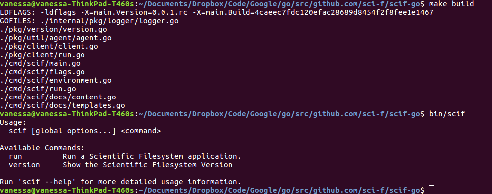
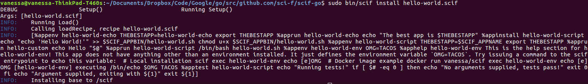

# Development Story

These are not notes intended to help developers, but the history of how it was developed.
This was an interesting experience for me, because it's not every day that you get to
learn a new language.

## Background

A lot of people experience joy when they socialize, go to new places,
or otherwise act as a consumer. I find that wherever you go, there you are.
You do not find happiness by changing location, items that you own, or what you
are adorned with. You can distract yourself from facing the present by thinking
about the future or immersing yourself in pleasurable experiences, but I've found
that these distractions make me feel empty. Learning new programming languages
are consistently the most satisfying experiences that I can remember. 

### Stage 1: The Dark Forest
It starts out confusing and twisty. Nothing has rule or reason, and you are largely
wandering in a lost forest, and looking at the trees. You spend days on end trying 
to solve the tiniest problems like "Where do I put this? How does this build?"
and you learn by looking at the other trees (examples) and trying this. 

### Stage 2: Starting to See
At some point you put two twigs together, and they don't fall apart. Your eyes
start to adjust, and you see things more clearly. It's still dark, but you
start to have vision for how you might construct a skeleton for a structure.

### Stage 3: Your Little House
Your first little dwelling is rough around the edges. You are constantly putting
sticks together, taking them apart, and sometimes the entire structure falls down.
This is where it starts to get fun. You've seen enough different structures around
the woods to have many things to try, and once you try them, you start to form
preferences. You realize that the first structure was way too complicated for what
you want to achieve. The second had an entire room that was expected, but completely
unnecessary given your goals.

### Stage 4: Falling in Love
This is where you start to fall in love. The construction is no longer confusing and
new, it's turned into a rhythm. It beats with your heart, and it starts to flow from
your fingers. The ideas that were just faint vision start to form in front of you.
At this point all possible fear is gone, and you are intimately attached to your work.
Hours, days, weeks can go buy, and the more that you build, the more that you learn.
You feel strong, empowered, and inspired.

This is largely what happens to me with learning a new language, and it most
definitely happened with GoLang here. Before this, I had only done small pull
requests to repositories. I had a really hard time understanding the organization
and evokation pathways of most programs. I can't say that I am now (or ever will be) an expert,
but I can assert that throwing yourself in and accepting vulnerability for doing
it wrong and imperfect is a way to grow.

## The Story

### 1. Work on Tiny Pieces First

If you've never looked at, read about, or otherwise interacted with the language,
then starting a library from nothing is not the first step you want to take.
I most definitely didn't start learning from zero to this. If this is true
for you, you should go find a repository on GitHub with the language you want to learn,
find a small issue such as adding a command line flag or anything flagged with
"good first issue" and try working on small pieces first. When you do this,
you'll unconsciously be figuring out how the software is invoked, how files
work together, and how to define variables and functions, and do basic for loops
and if statements.

### 2. Find an Example

I was so confused, generally, by the organization of these projects, that I first found
an [empty project template](https://github.com/golang-standards/project-layout) and
cloned it with a simple goal - to create a client entrypoint that then called
some set of library functions. Since I was working with the [scientific filesystem](https://sci-f.github.io)
the client would be "scif" and the functions would be the commands to install, run,
etc. So this is probably the first important advice:

> You need to want to accomplish a goal that you care about.

If you find tutorials or similar online, how could that be so interesting if the
person who created it has already solved it? How can it really challenge and help you
learn if there is complete certainty? It won't. I chose this particular
template repository because it would help to teach me about organization,
but also shower me with different examples (each
folder has a README.md that explains why it's there, and a huge list of repos
to look at as examples).

### 3. Understand the Structure

I'm one of those developers that spends an inordinate amount of time thinking
about organization. I want the files to be located where they would intuitively be looked for.
I want the organization to be simple and (as much as it could be) be self documented.
Thus, I read through the (original) README.md for a high level overview of the structure, 
and started to rewrite sections ([read here](notes.md)) to further develop my own understanding.
This was a bit of a Rosetta stone - I was taking a strange and confusing thing and writing 
it into my own words. I also read through [this post](https://medium.com/golang-learn/go-project-layout-e5213cdcfaa2) carefully to understand the repository structure, and what should go in each folder. 
For each section, I would inspect my cloned repository, and look at the README.md in the folder of inspection.
The mindset I had was to try and understand the folder's purpose, and then see a lot of
examples to confirm or deny if this was logical. For each, I only stopped looking when
I sort of "got it."

### 4. You Need a Build Script
We have the basic understanding that files are going to be compiled to generate
an entrypoint. It actually doesn't matter how broken your code is, you need
to first have a build strategy for generating errors for you to work with.
I wound up trying about 5-10 different building methods, but ultimately
found [a gist](https://gist.github.com/azer/7c83d0b59de8328355ad) that was
simple and easy to understand (and thus good to start with). Once I was able
to run a simple "make build" and spit out errors with the library, I was off
to a start!

### 4. Start with the Entrypoint

Once you have your Makefile and can compile to generate errors, make changes, and
then do it again, you're ready to start thinking about the code itself. This is
where thinking about the evocation pathway of the program comes into play. I knew
that I would want to call some binary "scif" and then have arguments processed,
and the environment looked at, and then based on what the user requested, pass
that on to client functions. To be fair, I had originally started development using
the "best practices" example, such as putting minimal code in the cmd folder.
As I was working on this, I was unhappy with the confusing organization of the folders.
It was too scattered, and I could never find things where I expected them to be. 
Since this all gets compiled into a binary anyway, the organization *should* be for the human. 
So I decided on the following (more intuitive) structure:

#### cmd

This is where I expect to find commands, organized by folders. So the main scif entrypoint (scif) would be here:

```bash
cmd/
   scif/
      main.go
      ...
      docs
      run.go
```

I also moved the "docs" folder to be part of the main package above, because 100% of
the content provided there was for the command entrypoint. Everything you see
under "scif" above is package "main." I wanted it to be intuitive - if I'm looking for
the client functions for when a user calls "scif run" I want them to be in the file "run.go."
In other words, each of the go files in the folder above should be the client entrypoint for that command.

#### pkg

The evocation then needed to move to libraries that (would be provided) if
sci-go were used as an external library. This means that we jump into the pkg folder,
and specifically, the "client" package that scif-go provides.

### client

The scif main entrypoint is going to be using these client functions, 
namely from a package called "client" that is (also intuitively)
under "pkg/client." The go files here are named to match the files in the `cmd/scif` folder. 
Thus, if I started at cmd/scif/run.go and I want to inspect what happens next, I know to look
in pkg/client/run.go. It's a no brainer! I don't want to have to jump around grep,
or following imports, or forgetting about internal folders. I want things
to be where I expect them to be. The developer can easily jump from an entrypoint command to the function that is run.

### 5. The First Compile

When you start, your client is largely just going to include possibly one command group,
and have a main execution function to print something to the screen.
But the moment when the thing first compiles, and you can run that thing? It's
amazing. There is nothing that feels better. I kept the memory, for posterity.



And for more posterity, I also documented the first time it ran and I successfully
read (and somewhat parsed) a file:



### 6. Add Meat

Now it gets easier, because you have a method. You can add something,
build it, and then try running it. For details on strategies for this,
see the [development docs](development.md). I largely stuck to developing on
my local machine until I was uncomfortable enough with making changes to the
filesystem, and then I developed in a container.

And once you are there, you made it! For me, this meant spending 4-8 hours of
uninterrupted programming time a day, almost to the point of forgetting to take
care of myself, because I was so in love with building this library. I felt
compelled to document the experience because it was so special to me.
